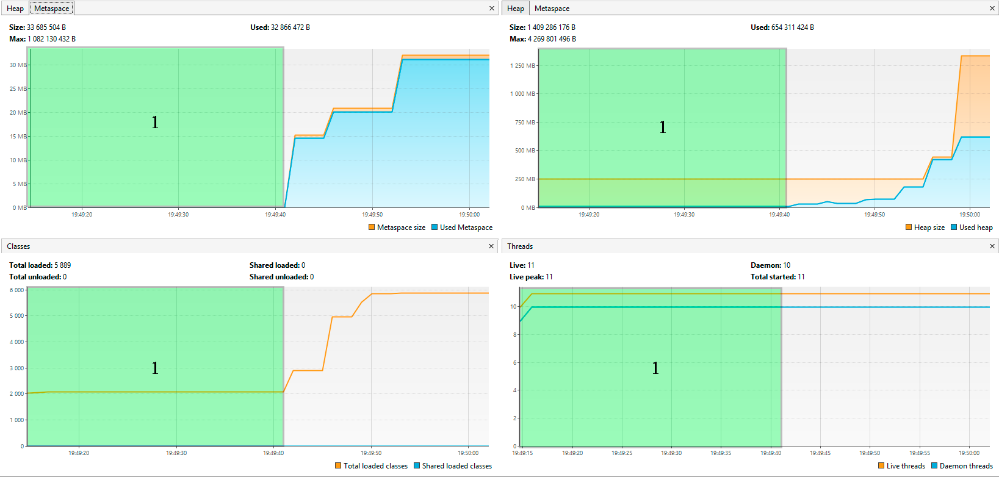
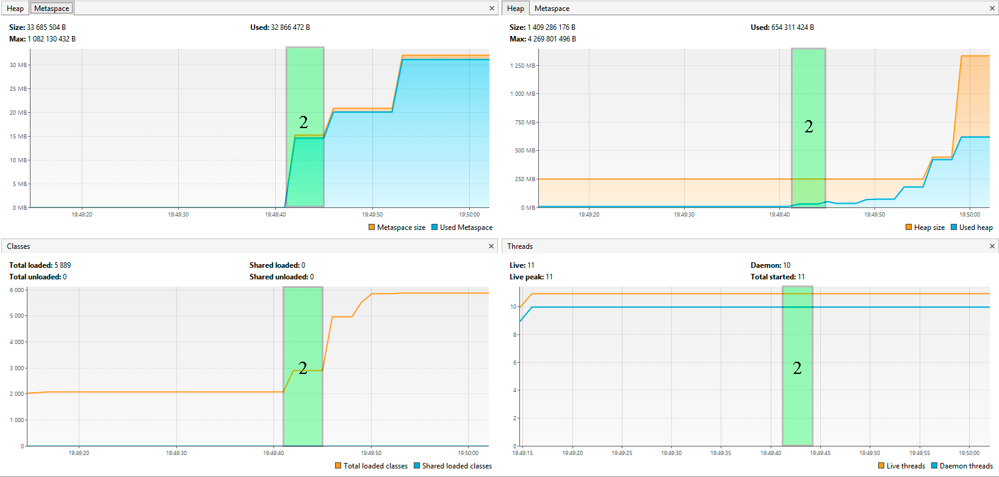
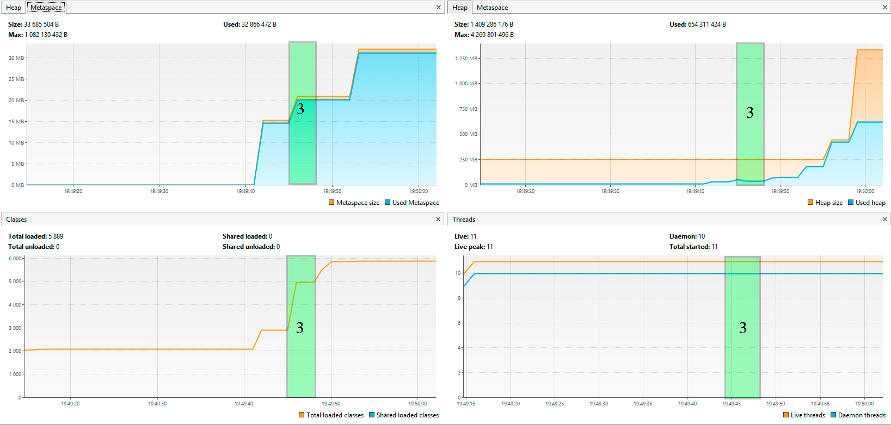
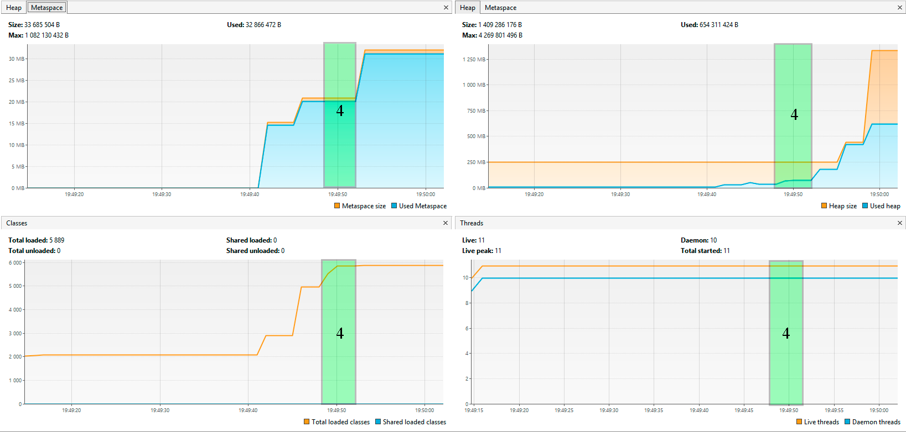
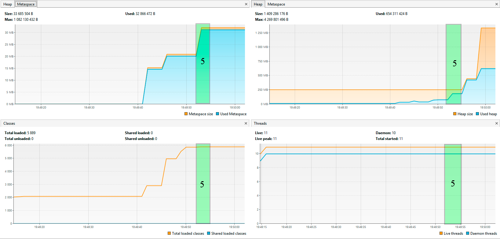
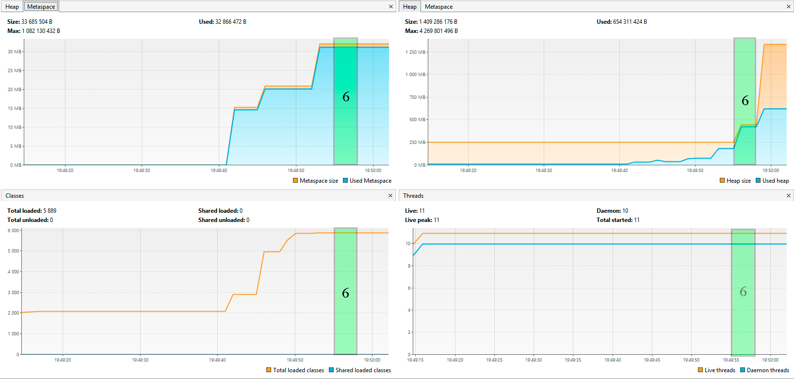
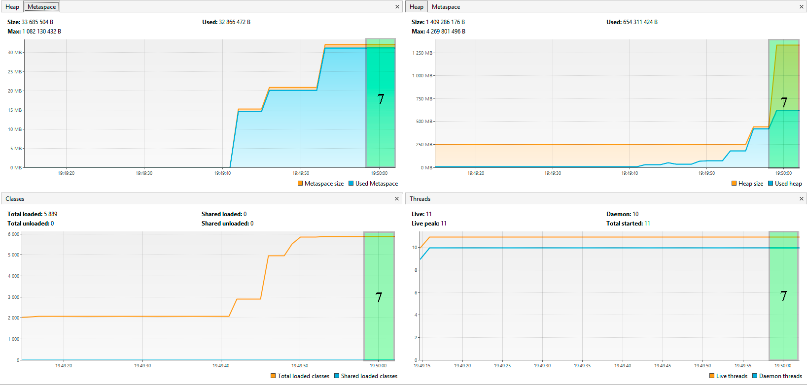

# Исследование JVM через VisualVM

При выполнении программы в консоль выводится следующая информация:

        19:49:10: Executing ':ru.netology.JvmExperience.main()'…
        
        > Task :compileJava UP-TO-DATE\
        > Task :processResources NO-SOURCE\
        > Task :classes UP-TO-DATE

        > Task :ru.netology.JvmExperience.main()\
        Please open 'ru.netology.JvmExperience' in VisualVm\
        19:49:41.362340400: loading io.vertx\
        19:49:41.836863400: loaded 529 classes\
        19:49:44.863022600: loading io.netty\
        19:49:45.782149600: loaded 2117 classes\
        19:49:48.784131800: loading org.springframework\
        19:49:49.101060700: loaded 869 classes\
        19:49:52.103712700: now see heap\
        19:49:52.103712700: creating 5000000 objects\
        19:49:52.390940: created\
        19:49:55.392989400: creating 5000000 objects\
        19:49:55.712344100: created\
        19:49:58.782826800: creating 5000000 objects\
        19:49:59.106007: created

        BUILD SUCCESSFUL in 51s\
        2 actionable tasks: 1 executed, 1 up-to-date\
        19:50:02: Execution finished ':ru.netology.JvmExperience.main()'.

Для представления работы программы и использования ресурсов разобъем процесс выполнения на следующие этапы:\
1 этап: временной диапазон 19:49:10 - 19:49:41.362340400;\
2 этап: временной диапазон 19:49:41.362340400 - 19:49:44863022600;\
3 этап: временной диапазон 19:49:44.863022600 - 19:49:48.784131800;\
4 этап: временной диапазон 19:49:48.784131800 - 19:49:52.103712700;\
5 этап: временной диапазон 19:49:52.103712700 - 19:49:55.392989400;\
6 этап: временной диапазон 19:49:55.392989400 - 19:49:58.782826800;\
7 этап: временной диапазон 19:49:58.782826800 - 19:50:02

## 1 этап: временной диапазон 19:49:10 - 19:49:41.362340400
Начинается загрузка классов программы в метаспейс, их связывание и инициализация.

Наблюдается:
- незначительное увеличение использования объема метаспейс;
- незначительное увеличение использования объема кучи;
- незначительный рост количества загруженных классов;
- незначительный рост количества потоков.

## 2 этап: временной диапазон 19:49:41.362340400 - 19:49:44.863022600
Начинается загрузка классов из пакета **io.vertx** в метаспейс.\

Наблюдается:
- увеличение использования объема метаспейс;
- незначительное увеличение использования объема кучи;
- рост количества загруженных классов;
- количество потоков остается неизменным.

## 3 этап: временной диапазон 19:49:44.863022600 - 19:49:48.784131800
Начинается загрузка классов из пакета **io.netty** в метаспейс.
Наблюдается:
- увеличение использования объема метаспейс;
- незначительное увеличение использования объема кучи;
- растет количество загруженных классов;
- количество потоков остается неизменным.

## 4 этап: временной диапазон 19:49:48.784131800 - 19:49:52.103712700
Начинается загрузка классов из пакета **org.springframework** в метаспейс.

Наблюдается:
- незначительное увеличение использования объема метаспейс;
- незначительное увеличение использования объема кучи;
- растет количество загруженных классов;
- количество потоков остается неизменным.

## 5 этап: временной диапазон 19:49:52.103712700 - 19:49:55.392989400
Начинается создание первых 5_000_000 объектов в куче.

Наблюдается:
- увеличение использования объема метаспейс;
- увеличение использования объема кучи;
- количество загруженных классов остается неизменным;
- количество потоков остается неизменным.

## 6 этап: временной диапазон 19:49:55.392989400 - 19:49:58.782826800
Начинается создание следующих 5_000_000 объектов в куче.

Наблюдается:
- использование объема метаспейс остается неизменным;
- увеличение использования объема кучи;
- количество загруженных классов остается неизменным;
- количество потоков остается неизменным.

## 7 этап: временной диапазон 19:49:58.782826800 - 19:50:02
Начинается создание следующих 5_000_000 объектов в куче.

Наблюдается:
- использование объема метаспейс остается неизменным;
- увеличение использования объема кучи;
- количество загруженных классов остается неизменным;
- количество потоков остается неизменным.

